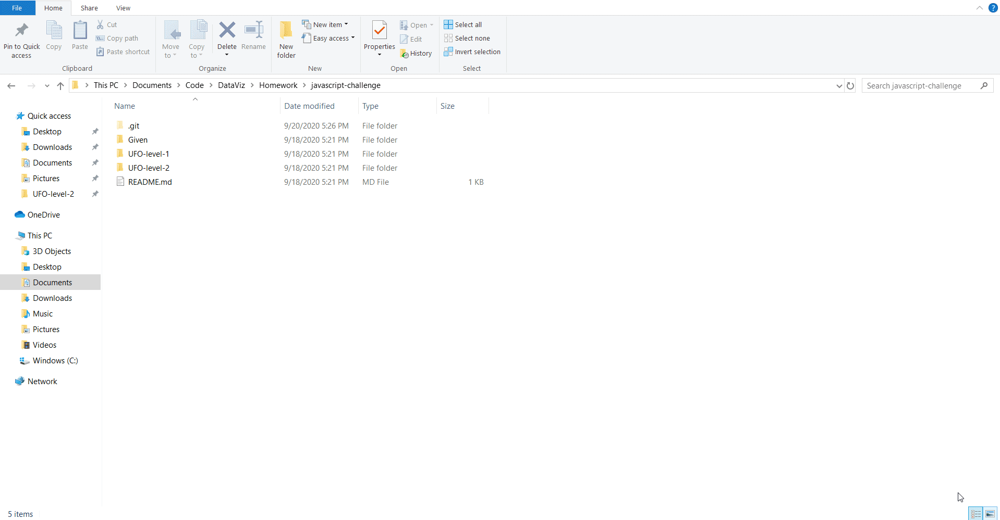

# javascript-challenge
Javascript focused challenge from Dataviz at UNCC.

## Given directory
Contains all given items for the challenge.

## UFO-level-1 directory
Contains index.html and static directory with javascript and css for completing the required portion of the challenge. Files inside successfully run a site to filter UFO sightings with one search box(Date).

## UFO-level-2 directory
Contains index.html and static directory with javascript and css for completing the requred+optional portion of the challenge. Files inside successfully run a site to filter UFO sightings with multiple search boxes(Date, city, state, country, and shape).

## How to use

The site has multiple filters and all are usable; however, the current dataset is not very large, so entering many criteria in the search bars may result in a query with no results. The image below shows the result for a query with no criteria in the search bars.

